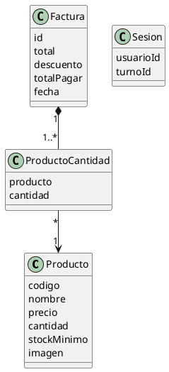
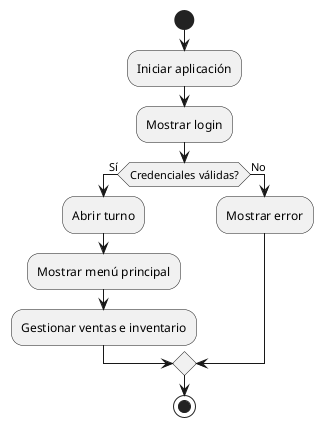
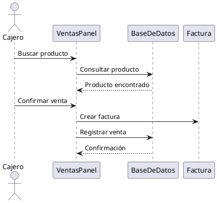

# 🛒 Sistema de Punto de Venta para Tienda de Abarrotes

Sistema desarrollado como proyecto integrador para la materia de **Programación Avanzada**, enfocado en la administración de ventas, inventario, compras y generación de reportes para una tienda de abarrotes.

---

# 📌 Información General

| Apartado | Información |
|---|---|
| Carrera | Ingeniería en Sistemas Computacionales |
| Facultad | Facultad de Ingeniería Tampico |
| Materia | Programación Avanzada |
| Profesor | Álvarez Navarro Eduardo |
| Grupo | M |
| Fecha de entrega | 22/05/2026 |

---

# 👥 Integrantes del Equipo

- Victor Jonathan Montoya Luna
- Elohim Alejandro Ozuna Domingo
- Ernesto Manuel Pérez Valadez
  

---

# 🎯 Objetivo General

Desarrollar un sistema de Punto de Venta capaz de administrar productos, inventario, ventas, compras, devoluciones y reportes para una tienda de abarrotes, utilizando herramientas de programación orientada a objetos y bases de datos locales.

---

# 🎯 Objetivos Específicos

- Automatizar el proceso de ventas.
- Llevar control de inventario y stock mínimo.
- Registrar entradas y salidas de mercancía.
- Generar recibos en formato PDF.
- Exportar reportes en formato CSV.
- Facilitar la administración de productos.
- Mejorar la organización y rapidez de operación.

---

# 🚀 Tecnologías Utilizadas

| Tecnología | Uso |
|---|---|
| Java Swing | Desarrollo de interfaz gráfica |
| SQLite | Base de datos local |
| JDBC | Conexión con base de datos |
| Apache PDFBox | Generación de recibos PDF |
| CSV | Exportación de reportes |

---

# 🧩 Alcance del Sistema

El sistema contempla los siguientes módulos principales:

- Inicio de sesión
- Gestión de productos
- Gestión de inventario
- Registro de compras
- Módulo de ventas
- Generación de recibos PDF
- Reportes de ventas
- Exportación CSV
- Control de devoluciones
- Control de stock mínimo
- Apertura y cierre de turno

El sistema está orientado a pequeñas y medianas tiendas de abarrotes que requieren una solución local y eficiente.

---

# 🧠 Descripción General del Proyecto

El flujo principal del sistema inicia cuando el usuario accede mediante el módulo de autenticación. Después de abrir turno y registrar el efectivo inicial, el usuario puede operar cualquiera de los módulos disponibles.

En el módulo de ventas, el cajero puede:

- Buscar productos mediante código o nombre
- Agregar productos al ticket
- Aplicar descuentos
- Realizar cobros
- Generar recibos automáticamente

Cuando una venta es finalizada:

- Se registra la factura
- Se descuenta inventario automáticamente
- Se genera el recibo PDF
- La venta queda disponible para consultas posteriores

En el módulo de compras se registran entradas de mercancía, aumentando automáticamente las existencias del inventario.

El sistema también permite:

- Registrar devoluciones
- Consultar productos con bajo stock
- Reimprimir recibos
- Exportar reportes compatibles con Excel

---

# 👤 Usuarios del Sistema

| Usuario | Función Principal |
|---|---|
| Administrador | Gestiona productos, reportes, inventario y usuarios |
| Cajero | Realiza ventas y genera tickets |
| Encargado de almacén | Registra compras y controla inventario |

---

# 🛠️ Requerimientos Funcionales

| ID | Requerimiento | Descripción |
|---|---|---|
| RF-01 | Inicio de sesión | Validación de usuarios y apertura de turno |
| RF-02 | Alta de productos | Registrar productos con código, precio e imagen |
| RF-03 | Edición de productos | Modificar información de productos |
| RF-04 | Eliminación de productos | Eliminar productos existentes |
| RF-05 | Gestión de inventario | Actualizar existencias automáticamente |
| RF-06 | Registro de compras | Agregar mercancía al inventario |
| RF-07 | Generación de ventas | Registrar productos vendidos |
| RF-08 | Generación de recibos | Crear tickets en PDF |
| RF-09 | Reportes | Consultar ventas por fecha |
| RF-10 | Exportación CSV | Exportar información compatible con Excel |
| RF-11 | Devoluciones | Registrar devoluciones y reintegrar stock |
| RF-12 | Reimpresión de recibos | Recuperar tickets anteriores |
| RF-13 | Stock mínimo | Configurar límites mínimos de inventario |
| RF-14 | Bajo stock | Mostrar alertas de inventario |
| RF-15 | Validaciones | Verificar datos obligatorios y existencia |

---

# 🔒 Requerimientos No Funcionales

## Seguridad

- Autenticación mediante usuario y contraseña
- Validaciones de campos obligatorios
- Confirmaciones antes de operaciones críticas
- Recomendación de cifrado de contraseñas para futuras versiones

## Rendimiento

- Respuesta rápida en consultas locales
- Manejo eficiente de inventario mediante SQLite
- Operación estable en equipos de bajos recursos

## Usabilidad

- Interfaz modular e intuitiva
- Navegación simple
- Tablas organizadas para consulta rápida
- Mensajes de error y confirmación

## Compatibilidad

- Compatible con Windows
- Compatible con Java JDK 17 o superior

---

# 💻 Hardware Recomendado

| Recurso | Requerimiento |
|---|---|
| RAM | 4 GB mínimo |
| Espacio en disco | 200 MB |
| Procesador | Doble núcleo o superior |
| Periféricos opcionales | Lector de códigos e impresora |

---

# 🗄️ Diccionario de Datos

## Clases Principales

| Clase | Atributo | Tipo | Descripción |
|---|---|---|---|
| Producto | codigo | String | Código único del producto |
| Producto | nombre | String | Nombre comercial |
| Producto | precio | double | Precio de venta |
| Producto | cantidad | int | Existencia disponible |
| Producto | stockMinimo | int | Límite mínimo permitido |
| Producto | imagen | String | Ruta de imagen |
| Factura | id | int | Identificador único |
| Factura | total | double | Total de venta |
| Factura | descuento | double | Descuento aplicado |
| Factura | totalPagar | double | Monto final |
| Factura | fecha | String | Fecha y hora |
| Sesion | usuarioId | int | Usuario activo |
| Sesion | turnoId | int | Turno activo |

---

# 🗃️ Tablas de Base de Datos

| Tabla | Campos Principales | Descripción |
|---|---|---|
| productos | codigo, nombre, precio, cantidad | Catálogo de productos |
| facturas | id, fecha, total | Ventas registradas |
| factura_productos | id_factura, codigo_producto | Detalle de ventas |
| compras | producto, cantidad, precio | Entradas de mercancía |
| devoluciones | factura_id, producto | Devoluciones registradas |
| usuarios | username, password | Usuarios del sistema |
| turnos | fecha_apertura, fecha_cierre | Control de caja |

---

# 🧱 Estructura del Proyecto

```text
src/
│
├── modelo/
├── controlador/
├── vista/
└── PDV/
```

---

# 🔄 Flujo Básico del Sistema

```text
1. Iniciar sesión
        ↓
2. Abrir turno
        ↓
3. Acceder al menú principal
        ↓
4. Gestionar productos o inventario
        ↓
5. Registrar ventas
        ↓
6. Generar tickets
        ↓
7. Consultar reportes
        ↓
8. Realizar cierre de turno
```

---

# 🧠 UML de Clases



---

# 🔄 UML de Actividades



---

# 📡 UML de Secuencia



---

# 🔗 Relaciones del Sistema

- Una factura contiene múltiples productos
- Un producto puede participar en varias ventas
- Una devolución pertenece a una factura
- Un usuario puede abrir y cerrar turnos
- Los módulos se conectan mediante la base de datos

---

# 🖥️ Interfaces del Sistema

| Interfaz | Función |
|---|---|
| VentanaLogin | Inicio de sesión |
| VentanaCaja | Apertura de turno |
| VentanaPrincipal | Navegación principal |
| VentasPanel | Registro de ventas |
| ProductosPanel | Gestión de productos |
| InventarioPanel | Control de inventario |
| ComprasPanel | Registro de mercancía |
| FacturasPanel | Reportes y recibos |
| VentanaCierreTurno | Cierre de caja |

---

# 📈 Flujo de Operación del Sistema

## Alta de Productos

```text
Productos → Capturar datos → Guardar producto
```

## Registro de Compras

```text
Compras → Capturar mercancía → Registrar compra → Actualizar stock
```

## Venta

```text
Ventas → Buscar producto → Agregar al ticket → Cobrar → Generar recibo
```

## Reportes

```text
Facturas → Seleccionar fechas → Filtrar → Exportar CSV o PDF
```

## Devoluciones

```text
Facturas → Seleccionar venta → Registrar devolución → Reintegrar stock
```

---

# 📚 Manual de Usuario

## Instalación

1. Instalar Java JDK
2. Verificar librerías necesarias
3. Abrir el proyecto en el IDE
4. Compilar el proyecto
5. Ejecutar la clase principal `PDV.Main`

---

# ⚙️ Compilación

```bash
javac -encoding UTF-8 -cp ".;lib\sqlite-jdbc-3.49.1.0.jar;lib\pdfbox-app-3.0.5.jar" -d bin src\modelo\*.java src\controlador\*.java src\vista\*.java src\PDV\*.java
```

---

# ▶️ Ejecución

```bash
java -cp "bin;lib\sqlite-jdbc-3.49.1.0.jar;lib\pdfbox-app-3.0.5.jar" PDV.Main
```

---

# 🧪 Operación del Sistema

1. Ingresar credenciales
2. Abrir turno
3. Registrar productos o ventas
4. Generar recibos
5. Consultar reportes
6. Realizar cierre de caja

---

# ✅ Matriz de Cumplimiento

| Requisito | Estado | Evidencia |
|---|---|---|
| Gestión de productos | Cumplido | ProductosPanel |
| Gestión de inventario | Cumplido | InventarioPanel |
| Ventas | Cumplido | VentasPanel |
| Reportes | Cumplido | FacturasPanel |
| Recibos PDF | Cumplido | PDFBox |
| Exportación CSV | Cumplido | Archivos CSV |
| Devoluciones | Cumplido | FacturasPanel |
| Stock mínimo | Cumplido | InventarioPanel |
| Validaciones | Cumplido | Formularios |
| Reimpresión de tickets | Cumplido | PDF generado |

---

# 📌 Características Destacadas

✅ Interfaz gráfica intuitiva  
✅ Persistencia de datos local  
✅ Generación automática de tickets PDF  
✅ Exportación de reportes CSV  
✅ Gestión automatizada de inventario  
✅ Arquitectura modular  
✅ Programación orientada a objetos  
✅ Sistema de control de turnos  

---

# 🧠 Aprendizajes Obtenidos

Durante el desarrollo del proyecto se fortalecieron conocimientos relacionados con:

- Programación orientada a objetos
- Manejo de interfaces gráficas
- Persistencia de datos
- Validación de información
- Diseño modular de software
- UML y modelado de sistemas
- Manejo de inventarios
- Generación de documentos PDF

---

# 📈 Conclusiones

El desarrollo del sistema permitió aplicar conocimientos de programación orientada a objetos, manejo de interfaces gráficas, bases de datos y generación de documentos.

El proyecto demuestra cómo una solución de escritorio puede automatizar procesos comerciales reales dentro de una tienda de abarrotes, mejorando la organización, rapidez y control de inventario.

---


---

# 🔗 Repositorio del Proyecto

```txt
https://github.com/ElohimAle/Programacion-Avanzada
```
